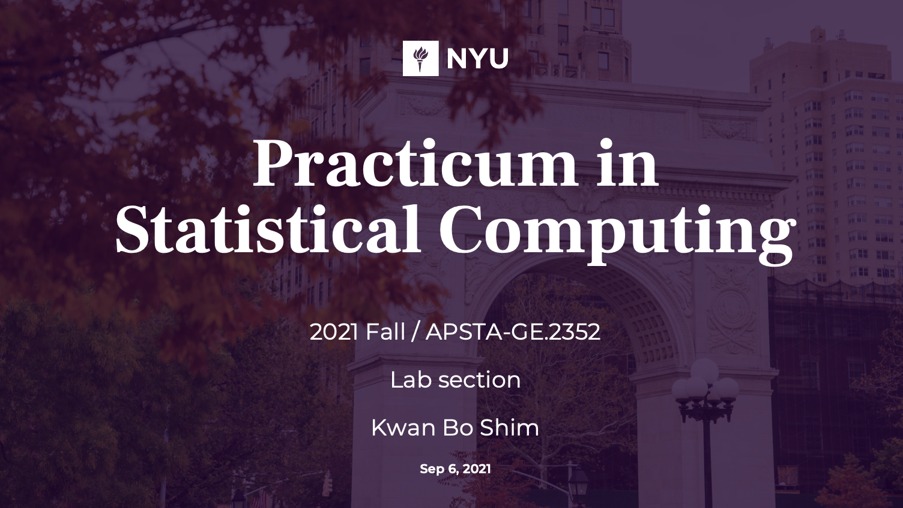

# Statistical Computing course (2021 Fall)
course sub-material for statistical computing class

[ [Week 1: codes & slides] ](https://github.com/JosephKBS/21fall_statcomp/tree/main/w1)[ [Week1: R Shiny app] ](https://apsta.shinyapps.io/StatCompWeek1/)

[ [Week 2: codes & slides] ](https://github.com/JosephKBS/21fall_statcomp/tree/main/w2)[ [Week2: R Shiny app] ](https://apsta.shinyapps.io/StatCompWeek2/)

[ [Week 3: codes & slides] ](https://github.com/JosephKBS/21fall_statcomp/tree/main/w3)[ [Week3: R Shiny app] ](https://apsta.shinyapps.io/StatCompWeek3/)

[ [Week 4: codes & slides] ](https://github.com/JosephKBS/21fall_statcomp/tree/main/w4)[ [Week4: R Shiny app] ](https://apsta.shinyapps.io/StatCompWeek4/)

[ [Week 5: codes & slides] ](https://github.com/JosephKBS/21fall_statcomp/tree/main/w5)[ [Week5: R Shiny app] ](https://apsta.shinyapps.io/StatCompWeek5/)

[ [Week 6: codes & slides] ](https://github.com/JosephKBS/21fall_statcomp/tree/main/w6) [ [Week6: R Shiny app] ](https://apsta.shinyapps.io/StatCompWeek6/)

